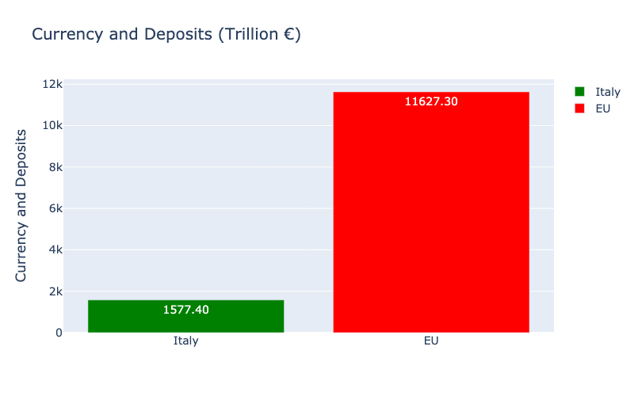
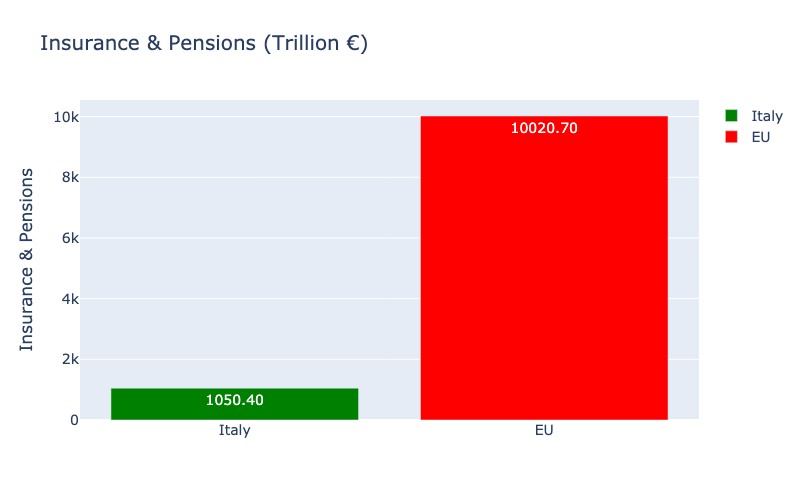
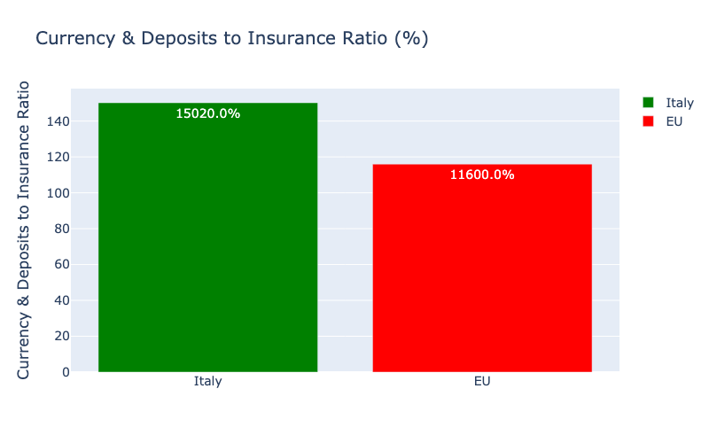
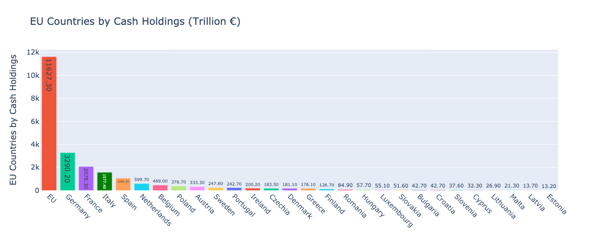
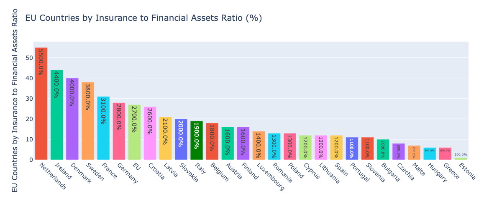
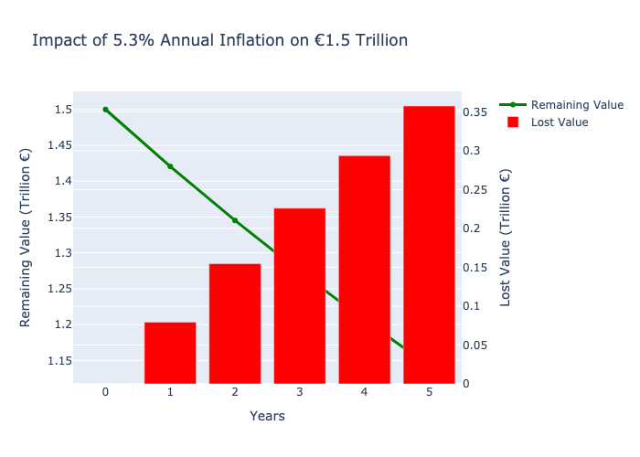

# The €1.5 Trillion Paradox: Italian Household Finances Analysis

This repository contains data analysis and visualizations supporting the LinkedIn article "The €1.5 Trillion Euros Paradox of Italian Households" by Davide Consiglio, Country Data Officer at Generali Italia.

## Key Findings

1. Italian households hold more than €1.5 trillion in cash deposits, representing a significant portion of their financial assets.
2. Compared to other EU countries, Italy shows a disproportionately high ratio of currency and deposits to insurance products.
3. The current inflation environment (>5% in recent years) erodes the real value of these liquid assets over time.
4. Advanced data analytics can help the insurance industry better understand household needs across their lifecycle.

## Data Source

The analysis is based on Eurostat data on financial assets and liabilities of households across EU countries, as published in the [Households - statistics on financial assets and liabilities](https://ec.europa.eu/eurostat/statistics-explained/index.php?title=Households_-_statistics_on_financial_assets_and_liabilities) report.

## Visualizations

### Comparison of Italy vs EU Averages

*Italian households hold €1.577 trillion in currency and deposits*

*Italy has €1.050 trillion in insurance products and pensions*

*Italy's ratio of currency/deposits to insurance is significantly higher than the EU average*

### EU Country Rankings

*Italy ranks among the top EU countries in absolute currency and deposit holdings*

*Italy's percentage of financial assets in insurance products is below the EU average*

### Impact of Inflation on Cash Holdings

*Projected loss of value of €1.5 trillion in cash holdings over 5 years with 5.3% annual inflation*

## Analysis Methodology

The analysis was conducted using Python with Pandas and Plotly libraries. The code processes the Eurostat data to extract key financial indicators and generate comparative visualizations. The full analysis script is included in the repository.

## License

The analysis and visualizations are provided for informational purposes. The Eurostat data is subject to Eurostat's usage policies.

## Contact

For more information, connect with [Davide Consiglio on LinkedIn](https://www.linkedin.com/in/davideconsiglio/). 